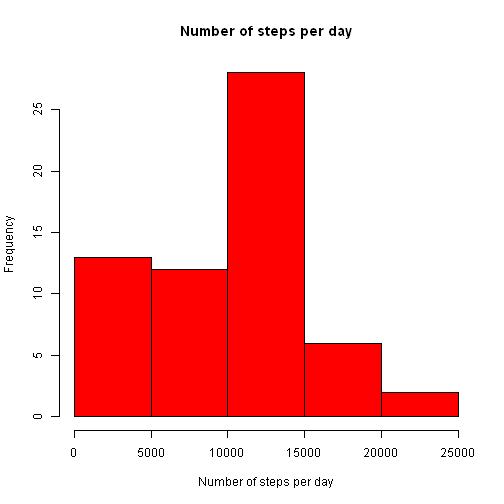
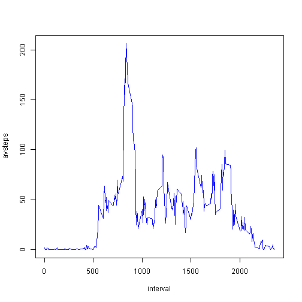
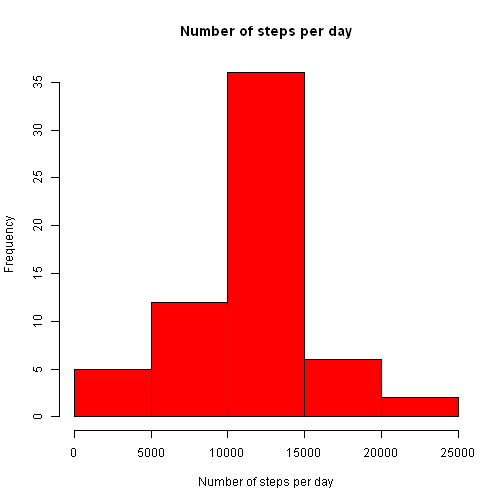
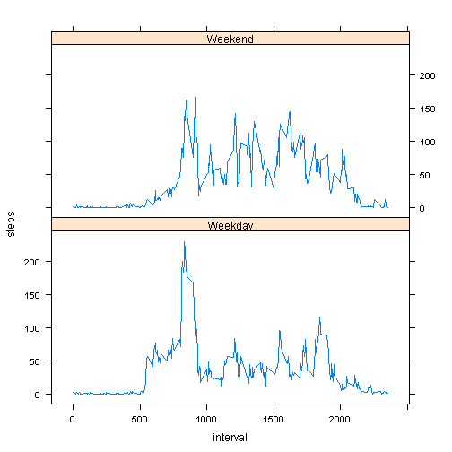

Reproducable Data Peer Assessment 1
========================================================

This document presents the steps gone through to complete the first Peer Assessment for the Reproducable Data course from John Hopkins University, via Coursera.  
  
The first step was to fork the assignment repository, which contained a zip file of data, so we begin by unzipping this and loading the resultant csv file into a dataframe.  From there we adjust te format of the date column and then it is ready to use.


```r
unzip("activity.zip")
table.df <- read.csv("activity.csv")
table.df$date <- strptime(table.df$date, format = "%Y-%m-%d")
table.df$date <- as.Date(table.df$date)
```


## What is mean total number of steps taken per day?  
  
To make a histogram of the total number of steps taken each day, we first melt and recast the data to sum the daily totals of steps, which requires the reshape2 package.  
  
We can ignore the missing values in the dataset.


```r
library(reshape2)
```

```
## Warning: package 'reshape2' was built under R version 3.0.3
```

```r
table_datemelt <- melt(table.df, id = ("date"), na.rm = TRUE)
table_datesum <- dcast(table_datemelt, date ~ variable, sum)
hist(table_datesum$steps, xlab = "Number of steps per day", main = "Number of steps per day", 
    col = "red")
```

 


We also calculate and report the mean and median total number of steps taken per day.


```r
daily_mean <- mean(table_datesum$steps, na.rm = TRUE)
daily_median <- median(table_datesum$steps, na.rm = TRUE)
```


The daily mean is **9354.23** steps whilst the daily median is **10395** steps.

## What is the average daily activity pattern?  
  
To find average values for each 5-minute interval across all days, we again melt and recast the data to average with respect to intervals, which we can then plot in a line grap to show average activity throughout a day.


```r
# melt and recast the data
table_intervalmelt <- melt(table.df, id = c("date", "interval"), na.rm = TRUE)
table_intervalavr <- dcast(table_intervalmelt, interval ~ variable, mean, na.rm = TRUE)

# rename steps column and remove date column as it doesn't make sense now
colnames(table_intervalavr)[colnames(table_intervalavr) == "steps"] <- "avsteps"
table_intervalavr$date <- NULL

# plot the activity
with(table_intervalavr, plot(interval, avsteps, type = "l", col = "blue"))
```

 


### Which 5-minute interval, on average across all the days in the dataset, contains the maximum number of steps?  
  

```r
max_steps <- subset(table_intervalavr, table_intervalavr$avsteps == max(table_intervalavr$avsteps))
max_interval <- max_steps$interval
```


The 5-minute interval that has the highest number of steps on average in the dataset, is **835**, which sees **835, 206.1698** steps on average.

## Inputing missing values

Note that there are a number of days/intervals where there are missing values (coded as NA). The presence of missing days may introduce bias into some calculations or summaries of the data.

### Calculate and report the total number of missing values in the dataset


```r
missing <- nrow(subset(table.df, is.na(table.df$steps)))
```


There are **2304** missing values in the dataset.

### Devise a strategy for filling in all of the missing values in the dataset.

I chose to use the mean for that 5-minute interval across all days.

### Create a new dataset that is equal to the original dataset but with the missing data filled in.


```r
# merge tables to have a column of averages at the end
table_filled.df <- merge(table.df, table_intervalavr, by = "interval")

# replace NAs with figure in the average column
for (i in 1:nrow(table_filled.df)) {
    if (is.na(table_filled.df$steps[i])) {
        table_filled.df$steps[i] <- table_filled.df$avsteps[i]
    }
}

# average column no longer needed
table_filled.df$avsteps <- NULL
```


### Make a histogram of the total number of steps taken each day and Calculate and report the mean and median total number of steps taken per day.


```r
table_datemelt_fill <- melt(table_filled.df, id = c("date", "interval"))
table_datesum_fill <- dcast(table_datemelt_fill, date ~ variable, sum)
hist(table_datesum_fill$steps, xlab = "Number of steps per day", main = "Number of steps per day", 
    col = "red")
```

 

```r
daily_mean_fill <- mean(table_datesum_fill$steps)
daily_median_fill <- median(table_datesum_fill$steps)
```


Therefore, when substituting the average values for the interval, the daily mean is **10766.19** steps whilst the daily median is **10766.19** steps.

### Do these values differ from the estimates from the first part of the assignment? What is the impact of imputing missing data on the estimates of the total daily number of steps?

These values are slightly higher than those before we added the averages in, which implies that the NA values often occurred at times that on other days had above average number of steps.  
  
This could also imply that it was less likely to return an NA value during low activity, which is borne out by the differing histograms.  In our first, the 0-5000 region was the second higest, whereas after substitution it drops to fourth out of five.  This could perhaps stem from a technical limitation but we do not have the data to say.  
  
The fact that the median and the mean are the same is due to such a high proportion (2304 of 17568 observations) being substituted.

## Are there differences in activity patterns between weekdays and weekends?

We create a new factor variable in the dataset with two levels - "weekday" and "weekend" indicating whether a given date is a weekday or weekend day.


```r
for (i in 1:nrow(table_filled.df)) {
    if (weekdays(table_filled.df$date[i]) == "Saturday" | weekdays(table_filled.df$date[i]) == 
        "Sunday") {
        table_filled.df$daytype[i] <- "Weekend"
    } else {
        table_filled.df$daytype[i] <- "Weekday"
    }
}
```


Finally, we plot the activity at weekends above that at weekend for a comparison.


```r
library(lattice)
```

```
## Warning: package 'lattice' was built under R version 3.0.3
```

```r
table_daytypemelt <- melt(table_filled.df, id = c("date", "interval", "daytype"))
table_daytypeavr <- dcast(table_daytypemelt, daytype + interval ~ variable, 
    mean)
xyplot(steps ~ interval | daytype, data = table_daytypeavr, layout = c(1, 2), 
    type = "l")
```

 


Unsurprisingly we can see that activity starts earlier on weekdays, at somewhere between 8am and 9am, but tailing off between 3pm and 4pm, whereas weekends see higher average use after this time of day.
